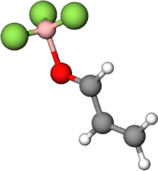
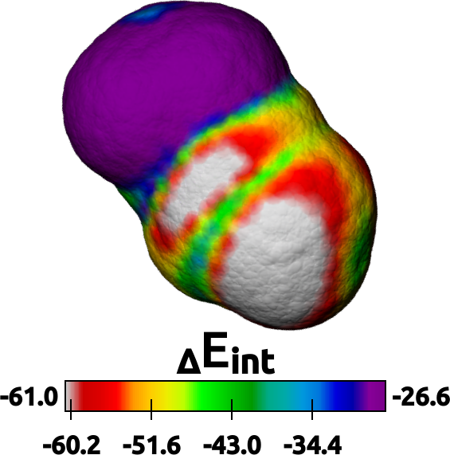
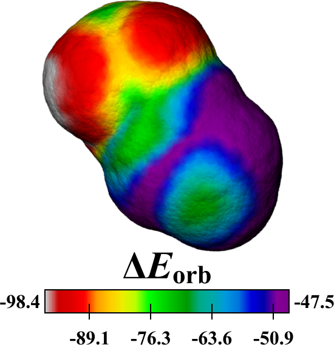

# Molecular interaction potential maps (IMIP) surface generator

## Description
This Python script generates an IMIP surface from a given XYZ file. The detailed information is described in the following paper:

**Amin Kiani**, **Wentong Zhou**, and **Lawrence M. Wolf** "Using molecular interaction potential maps derived from energy decomposition analysis to interpret electronic structure and reactivity. " 2023 In Manuscript.

<div align="center">

</div>

## Dependencies
- Tested on `Python 3.10.0`
- Grid generations and operations: `numpy`, `scipy`, `pandas`, `scikit-learn`,`open3d`
- Quantum chemistry calculations: `turbomoleio`,`ase`,`pyscf`,`xtb-python`
- Visualization: `ovito`
- Other utilities:`tqdm`

All Density Functional Theory(DFT) calculations use `Turbomole` or `xTB/xTBiff` packages. For details, please refer to the official websites of [Turbomole](http://www.turbomole.org/) and [xTB](https://xtb-docs.readthedocs.io/en/latest/).

`Multiwfn(3.8dev)`  is used to calculate electron density values of generated grids after obtaining DFT-calculated wavefunctions. For details, please refer to the official website of [Multiwfn](http://sobereva.com/multiwfn/).

Surface Visualization is performed using `Ovito Pro`. For details, please refer to the official website of [Ovito](https://www.ovito.org/docs/current/python/introduction/index.html).

### Installation
- Install `Turbomole` and/or `xTB` packages.
- Install `Ovito Pro` and `Ovito python api`.
- Install `Multiwfn(3.8dev)`.
- Install `numpy`, `scipy`, `pandas`, `scikit-learn`,`open3d`,`tqdm`,`ase`,`pyscf`,`xtb-python` using `pip` or `conda`.
```bash
# add this to bashrc
export PYTHONPATH=/path/to/IMIP:$PYTHONPATH
```

## Usage
### 1. Grid generation


```python
import IMIP.grid as gd
grid_configs = {
    "molecule": "h2.xyz", # molecule xyz file
    "chrg": 0, # molecule charge
    "multiplicity": 1, # molecule multiplicity
    "probe": "Li", # probe
    "probe_chrg": 1, # probe charge
    "type": "xtb", # electron density calculation method
    "isovalue": 0.001, # electron density isovalue
    "spacing": 0.04, # grid spacing for grid generation
    "rad_val": 0.7, # probe radius
    "num_gridpoints": 10000, # number of grid points
    "filtration": 0.3, # filtration radius
    "tangent_radius": 0.5, # tangent radius for get normal vector
    "tangent_max_nn": 40, # maximum number of nearest neighbors for get normal vector
    "redirection": true, # whether to perform redirection
    "range_ve": 1.05, # range of electron density values for surface
    "range_redir": 0.0001, # range of electron density values for surface after redirection
    "tight": false # whether to perform tight rigid-body scan for molecular probes
}

# generate grid
result = gd.Grid.load_file(configs=grid_configs)
```
Users can put the **limited keys and values (Users only add the items they want to change. Typically, users' `configs` is much shorter than shown here)** in the `grid_configs` dictionary to change the default values. The default values are listed above


### 2. Turbomole LMO-EDA surface generation
```python
import IMIP.QM_EDA.turbomole as tm
tmol_configs = {
  "molecule": "h2.xyz",
  "chrg": 0,
  "multiplicity": 1,
  "probe": "Li",
  "probe_chrg": 1,
  "type": "xtb",
  "isovalue": 0.001,
  "spacing": 0.04,
  "rad_val": 0.7,
  "num_gridpoints": 10000,
  "filtration": 0.3,
  "tangent_radius": 0.5,
  "tangent_max_nn": 40,
  "redirection": True,
  "range_ve": 1.05,
  "range_redir": 0.0001,
  "tight": False,
  "functional": "r2scan", # DFT functional
  "basis": "def2-SVP", # DFT basis set
  "radsize": 5,     # DFT integration grid size
  "damp": [0.3,0.05,0.1], # DFT damping parameters
  "shift": 0.2, # DFT shift parameter
  "marij": false, # DFT marij parameter
  "lastdiag": false, # DFT lastdiag parameter
  "solvent": "None", # DFT solvent model
  "restart": 0 # DFT restart parameter, 0 for no restart, 1 for restart
}

result = tm.TurbomoleRunner.load_file(tmol_configs=tmol_configs)
```
When users run the Turbomole LMO-EDA surface generation， most parameters are set to default values and inherited from `Grid` parameters. Users can put the **limited keys and values** in the `tmol_configs` dictionary to change the default values. The default values are listed above.

After the Turbomole LMO-EDA surface generation, the results will be saved in two files:
- `{mol_name}_turbomole.xyz`: extended xyz file containing the generated surface and the corresponding energy values
- `energy_values_{mol_name}.out`: energy values of the generated surface

### 3. xTB-iff surface generation
```python
import IMIP.QM_EDA.xtb as xtb
xtb_configs = {
    "molecule": "h2.xyz",
    "chrg": 0,
    "multiplicity": 1,
    "probe": "Li",
    "probe_chrg": 1,
    "type": "xtb",
    "isovalue": 0.001,
    "spacing": 0.04,
    "rad_val": 0.7,
    "num_gridpoints": 10000,
    "filtration": 0.3,
    "tangent_radius": 0.5,
    "tangent_max_nn": 40,
    "redirection": True,
    "range_ve": 1.05,
    "range_redir": 0.0001,
    "tight": False,
    "gfn": 2 # xTB gfn1 or gfn2
}

result = xtb.xTBRunner.load_file(xtb_configs=xtb_configs)

```
When users run the xTB-iff surface generation， most parameters are set to default values and inherited from `Grid` parameters. Users can put the **limited keys and values** in the `xtb_configs` dictionary to change the default values. The default values are listed above.

After the xTB-iff surface generation, the results will be saved in two files:
- `{mol_name}_xtb.xyz`: extended xyz file containing the generated surface and the corresponding energy values
- `energy_values_xtb_{mol_name}.out`: xTB-iff energy values of the generated surface


### 4. Render the image of molecular structure and generated surface

#### 4.1 Render the image of molecular structure using `Ovito Python API`
```python
import IMIP.vis_ovito as ov

ovi_configs = {"molecule":'h2.xyz'} # molecule xyz file
mol = ov.Ovito.load_file(ovito_configs=ovi_configs)
mol.vp.camera_dir = (0,0,1) # camera direction coordinates
mol.vp.fov = fov # camera vertical field of view
mol.render() # render the image
```
<p align="left">
  
  
</p>


#### 4.2 Render the image of generated surface using `Ovito Python API`
Once the extended xyz file is generated, users can use `Ovito Python API` to render the image of generated surface.
Run the following code to render the image of generated surface. Put the molecule and extended `xyz` file in the same directory

```python
ovi_configs = { "molecule": "h2.xyz", # molecule xyz file
                "grid_type": "xtb", # grid energy value source, for now: xtb or turbomole
                # EDA energy terms: Tot, Orb, Electro. 
                # For details, please refer to ovito_grid_header in Utils/variables.py.
                "grid_term": "Orb", 
                "grid_surface": False, # whether to generate surface
                "grid_r_scale": 1, # energy value scale right bound coefficient
                "grid_l_scale": 1  # energy value scale left bound coefficient
              }     
mol = ov.Ovito.load_file(ovito_configs=ovi_configs)
mol.vp.camera_dir = (0,0,1) # camera direction coordinates
mol.vp.fov = fov # camera vertical field of view
mol.render_grid() # render the image of generated surface
```
**Unit**: **kcal/mol**
<p align="left">
  
  
  
</p>

### 5. Ovito Usage to visualize the generated surface

For detailed usage of Ovito to visualize the extended xyz file, please refer to the documentation of Ovito for [XYZ file reader](https://www.ovito.org/manual/reference/file_formats/input/xyz.html) and [Construct surface mesh](https://www.ovito.org/manual_testing/reference/pipelines/modifiers/construct_surface_mesh.html#particles-modifiers-construct-surface-mesh).


## To-do list
- [x] Efficient grid and surface generation based on `Turbomole` and `xTB`.
- [ ] Add automated visualization script.
- [ ] Add more QM packages to calculate different types of EDA energy values. (For example,`Orca` or `Gaussian`) 
- [ ] GUI for users to set parameters and more code parallelization.


## Citation
If you use this code, please cite the following paper:
```bibtex

```


## Author
- Wentong Zhou

## Contributors
- Wentong Zhou
- Amin Kiani
- Lawrence M. Wolf


